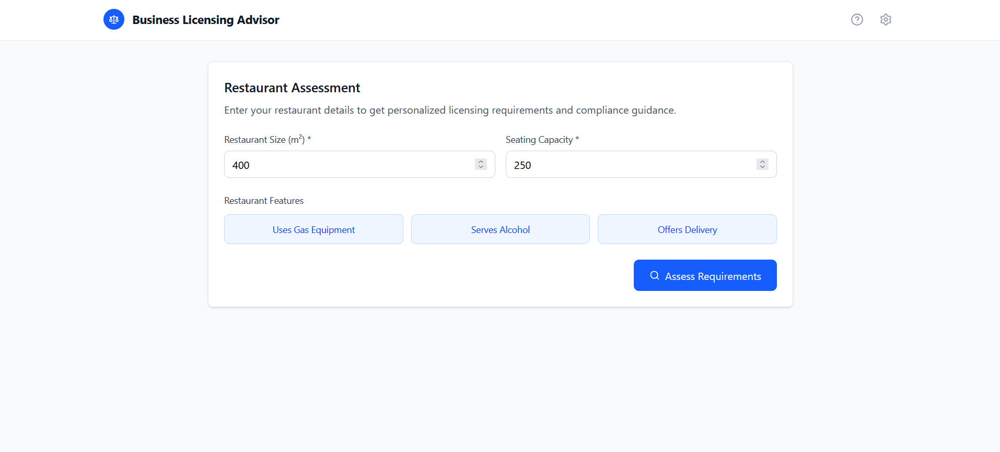
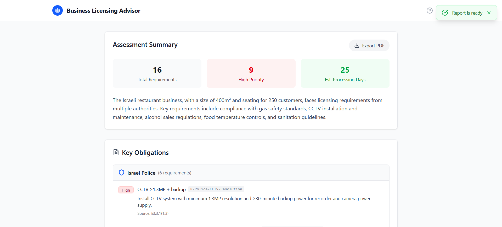
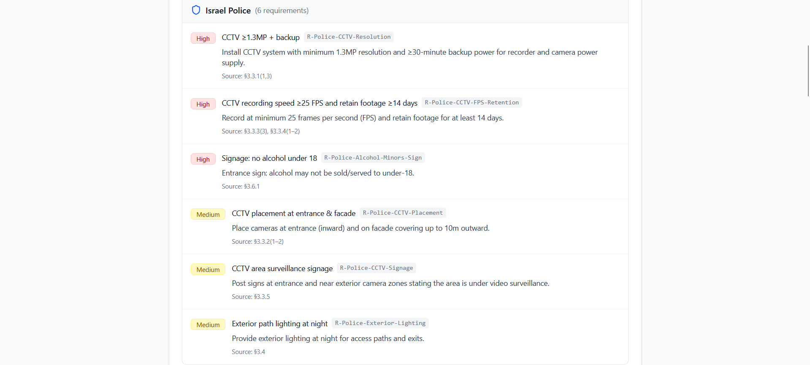
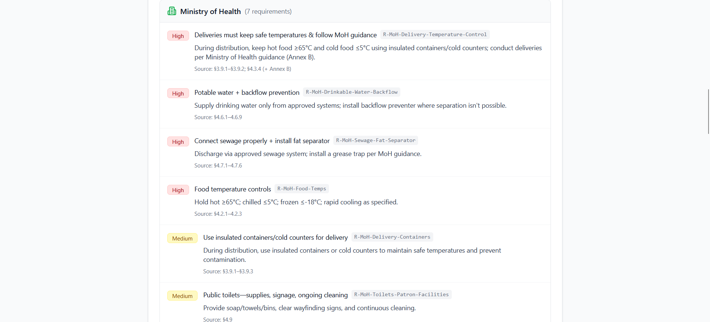
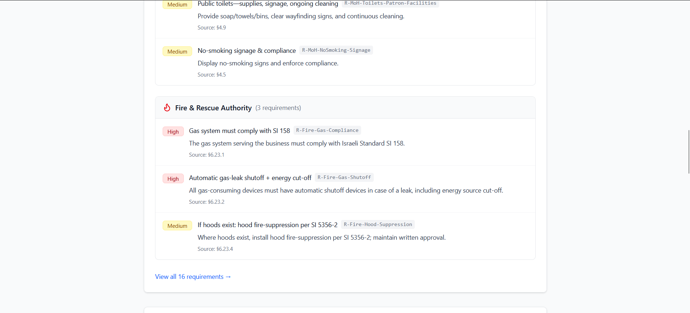
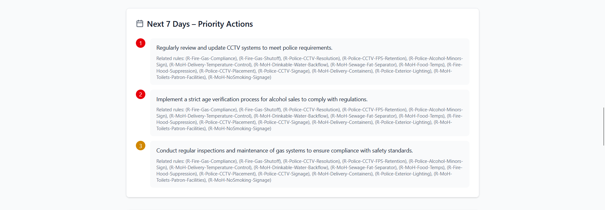
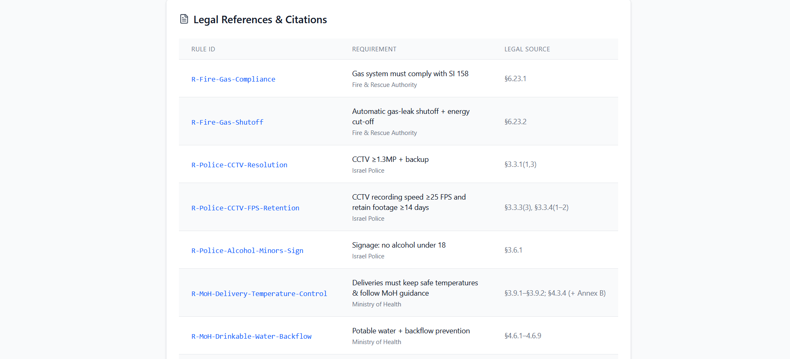
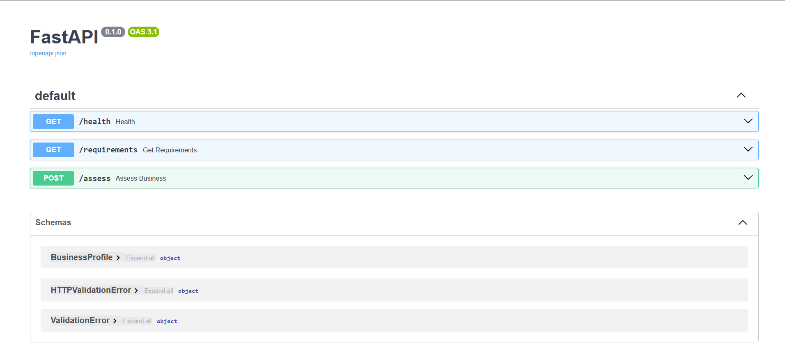

# Business Licensing Advisor

An AI-powered system helping Israeli restaurant owners understand regulatory licensing requirements through personalized reports.

## 🎯 Project Overview

This system processes Hebrew regulatory documents and provides personalized licensing guidance using:
- **Rule Matching Engine**: Deterministic filtering based on business characteristics
- **AI Report Generation**: GPT-3.5-turbo creates clear, actionable reports
- **Bilingual Support**: Hebrew source material with English translations

## 🚀 Quick Start

### Prerequisites
- Python 3.9+
- Node.js 18+
- OpenAI API Key

### 1. Clone Repository
```bash
git clone <repository-url>
cd biz-licensing-advisor
```

### 2. Backend Setup
```bash
cd backend
pip install fastapi uvicorn openai python-dotenv pydantic
uvicorn app:app --reload
```

### 3. Frontend Setup
```bash
cd frontend
npm install
npm run dev
```

### 4. Environment Configuration
Create `.env` file in project root:
```bash
OPENAI_API_KEY=sk-proj-your-key-here
```

## 🌐 Live Demo
- **Frontend**: https://biz-licensing-advisor.vercel.app/
- **Backend API**: https://biz-licensing-advisor.onrender.com/docs

## 📸 Screenshots

### Questionnaire Interface


### Generated Report



\



### API Documentation


### 5. Access Application
- **Frontend**: http://localhost:5173
- **Backend API**: http://localhost:8000
- **API Docs**: http://localhost:8000/docs

## 📋 Dependencies

### Backend (Python)
- `fastapi` - Modern web framework
- `uvicorn` - ASGI server
- `openai` - GPT-3.5-turbo integration
- `pydantic` - Data validation
- `python-dotenv` - Environment management

### Frontend (React)
- `react` ^19.1.1 - UI framework
- `react-dom` ^19.1.1 - DOM rendering
- `vite` ^7.1.2 - Build tool
- `@vitejs/plugin-react` - React support

## 🏗️ System Architecture

```
Frontend (React) ←→ Backend (FastAPI) ←→ OpenAI API
                           ↓
                    Data Layer (JSON)
```

### Components
- **Frontend**: Business questionnaire + report display
- **Backend**: API server with 3 endpoints (`/health`, `/assess`, `/requirements`)
- **Matching Engine**: Rule filtering algorithm
- **LLM Integration**: AI report generation
- **Data**: 17 curated Israeli licensing rules

## 📊 Usage Flow

1. **Input**: User fills business profile (size, seats, alcohol, gas, misting, delivery)
2. **Matching**: System filters 17 rules based on business characteristics
3. **AI Processing**: GPT-3.5-turbo generates personalized report
4. **Output**: Structured report with requirements and recommendations

## 🧪 Testing

### Backend Tests
```bash
cd backend
python -m pytest tests/ -v
```

### Test Coverage
- Rule matching logic (5 business scenarios)
- LLM integration with real API
- Input validation and error handling

## 📁 Project Structure

```
biz-licensing-advisor/
├── backend/           # FastAPI server
│   ├── app.py        # Main API endpoints
│   ├── matching.py   # Rule matching algorithm
│   ├── llm.py        # OpenAI integration
│   └── tests/        # Test suite
├── frontend/         # React application
│   └── src/          # Components and assets
├── data/             # Licensing rules database
│   └── requirements.json  # 17 curated rules
├── docs/             # Technical documentation
│   ├── api.md        # API endpoints
│   ├── architecture.md # System design
│   ├── data-schema.md  # Data structures
│   ├── matching.md   # Algorithm explanation
│   ├── dev-log.md    # Development history
│   └── prompts.md    # Development prompts
├── ai/               # AI tools documentation
│   └── tools.md      # Development tools used
└── scripts/          # Data processing utilities
```

## 🤖 AI Tools Used

### Development
- **Claude Code**: Primary development assistant for coding, debugging, architecture
- **ChatGPT**: System planning and MVP design
- **Replit**: Mock web app for UX validation

### LLM Integration
- **Model**: GPT-3.5-turbo (optimized for speed)
- **Max Tokens**: 1000
- **Purpose**: Generate personalized licensing reports

## 📖 Documentation

### Technical Docs
- [API Documentation](docs/api.md) - Endpoint specifications
- [Architecture](docs/architecture.md) - System design and components
- [Data Schema](docs/data-schema.md) - Data structures and validation
- [Matching Algorithm](docs/matching.md) - Rule filtering logic

### Development Docs
- [Development Log](docs/dev-log.md) - Project history and decisions
- [AI Tools](ai/tools.md) - Development tools documentation
- [Prompts](docs/prompts.md) - Development conversation history

## 🎯 Features

### Completed Features ✅
- ✅ Rule matching engine with 17 Israeli licensing requirements
- ✅ AI-powered report generation using GPT-3.5-turbo
- ✅ RESTful API with FastAPI
- ✅ React frontend with business questionnaire
- ✅ Report display interface with PDF export
- ✅ Comprehensive test suite
- ✅ Complete technical documentation
- ✅ Production-ready deployment configuration

## ⚡ Performance

- **Rule Matching**: <100ms (deterministic algorithm)
- **LLM Report Generation**: 2-5 seconds
- **Total Response Time**: 2-6 seconds
- **Data Size**: 17 rules, <10MB storage

## 🔧 Development Commands

### Backend
```bash
cd backend
uvicorn app:app --reload      # Start dev server
python -m pytest tests/      # Run tests
python matching.py           # Test matching engine
```

### Frontend
```bash
cd frontend
npm run dev                   # Start dev server
npm run build                # Build for production
npm run lint                 # Run linter
```

## 🛡️ Error Handling

- **Missing API Key**: Clear error message with setup instructions
- **LLM API Failure**: Fallback to rule list with error notification
- **Invalid Input**: Pydantic validation with detailed error messages
- **File Not Found**: Graceful degradation with empty rule set

## 📈 Future Improvements

- **Database Migration**: Move from JSON to PostgreSQL for complex queries
- **Caching**: Redis for faster repeated requests
- **Async Processing**: Background report generation
- **Multi-language**: Full Hebrew UI support
- **Advanced Analytics**: Business trend analysis

## 🤝 Contributing

This project was developed as part of a technical assessment demonstrating:
- AI-first development approach
- Full-stack system design
- Real-world regulatory data processing
- Production-ready code quality

## 📄 License

Developed for educational and assessment purposes.